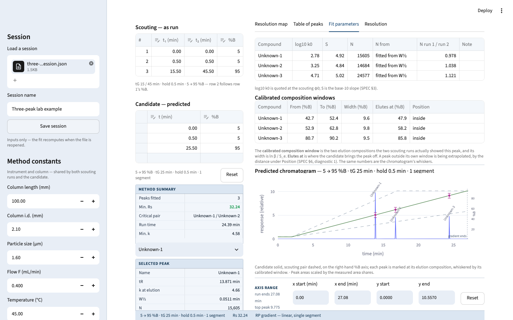

# LC-PDA Simulator — HPLC gradient prediction

A Python HPLC simulator for working chromatographers, inspired by ACD/Labs Method Selection Suite: enter two gradient scouting runs, fit per-peak LSS retention parameters, and predict retention times, peak widths, resolution, and the chromatogram for any candidate gradient programme.

**Version: v0.2.1 — public feedback release.** The candidate is no longer tied to the scouting runs' composition range: it carries its own start, its own end and any number of segments, entered as a programme table in the rail. Predictions outside what the two scouting runs calibrated are still made, and are marked for what they are — the composition-window readout says per peak how far outside it sits, and resolution that was never pinned there is stamped *indicative, not decision-grade*.

The approved specification is [SPEC.md](SPEC.md). The [cycle maps](docs/roadmap.md)
explain v0.1 and v0.2, with historical specifications included in this repository.
Read the [v0.2.1 release notes](docs/releases/v0.2.1.md) for changes and limitations.

This release models chromatographic separation. It does not simulate PDA spectra.

## Quickstart

You need [uv](https://docs.astral.sh/uv/) and Python ≥ 3.12 — uv fetches a matching interpreter itself if you have none. Every command below is run from the repo root; uv creates and syncs the environment on first use, so there is no separate install step.

### Run the app

Clone the repository (or download and extract its ZIP), then run:

```bash
git clone https://github.com/zhipengzhu1-dotcom/11-Sep-2026-LC-PDA-Simulator-v0.2.0.git hplcsim
cd hplcsim
uv run --locked --python 3.12 --extra app streamlit run streamlit_app.py
```

Then open <http://localhost:8501>.

`--extra app` is not optional: Streamlit, pandas and plotly are declared as an optional
extra, so a plain `uv run streamlit …` fails on a fresh checkout. On its very first launch
Streamlit asks for an email address — press Enter to skip it, or add `--server.headless true`
to suppress the prompt (that also stops it opening a browser tab for you).

### Run the tests

```bash
uv run --locked --extra app pytest
```

This is the whole bar: the internal, reference and reality layers of SPEC §10, plus the
end-to-end fixtures built from the lab runs in `validation/`.

### Lint, format and type-check

```bash
uv run --locked --extra app ruff check
uv run --locked --extra app ruff format --check
uv run --locked --extra app mypy
```

`mypy` runs strict over the engine (`src/hplcsim`) and the app's logic layer (`app/`); only
the root `streamlit_app.py` entry point is excluded.

## Try the included example

Open **Session** in the left sidebar and upload [examples/three-peak-session.json](examples/three-peak-session.json). It loads the two scouting runs, measured peak widths, and a 25-minute candidate. Compare predicted retention times with [validation/run3.csv](validation/run3.csv): measured 13.787, 16.658, and 24.358 minutes. See the [example guide](examples/README.md) for the inputs and limitations.



## Driving it with real data

`validation/` includes the first four real runs of the same three-compound mixture on a Waters Acquity
H-Class with a CORTECS UPLC Shield RP18 column, which makes it the fastest way to see the
app do something true:

1. **Fill the sidebar** from `validation/method.csv` — 100 × 2.1 mm, 1.6 µm, 0.4 mL/min,
   5 → 95 %B, 0.5 min initial hold, dwell 0.9375 min, t0 0.525 min.
2. **Enter the peaks** from `validation/run1.csv` (tG 15 min) and `validation/run2.csv`
   (tG 45 min) — three compounds, each with a retention time, an area and a W½ per run.
   Those two are the scouting pair.
3. **Predict**: set a candidate tG of 25 min and compare against `validation/run3.csv`, which
   is the same method actually run on the instrument. tG 60 min extrapolates against `run4.csv`.

Two honest caveats about that dataset: the dwell volume is the instrument spec-sheet figure,
**not** a measured one, and t0 is the solvent front read off `validation/run1-chromatogram.png`
rather than an injected marker. Both are recorded with their provenance in
`validation/method.csv`, and `validation/PROTOCOL.md` describes how the runs were collected.

Sessions save and reload as a JSON file from within the app (SPEC §8). The file holds
**inputs only** — the fit recomputes on load, so a session file never carries a stale result.

## Feedback and limitations

Please [open an issue](https://github.com/zhipengzhu1-dotcom/11-Sep-2026-LC-PDA-Simulator-v0.2.0/issues/new/choose) with what you tried, expected, and observed. Onboarding friction, gradient-table usability, and predictions compared with measured runs are especially useful. Include a session JSON only when you can share its contents publicly.

The model uses a two-run LSS fit. Temperature is metadata, CSV import and automated peak matching are deferred, and the resolution map is a placeholder for v0.7. Multi-segment retention has limited bench validation; **multi-segment resolution has no validation claim**. See [SPEC.md, §10](SPEC.md) and the [release limitations](docs/releases/v0.2.1.md).

## Roadmap

Planned scope, not delivery dates or implemented features. Authority: [SPEC.md, §11](SPEC.md); full cycle history in [docs/roadmap.md](docs/roadmap.md).

| Cycle | Planned scope |
|---|---|
| v0.1.0 | Two scouting runs, LSS fit, linear-gradient prediction, widths, resolution, diagnostics, session save/load — **shipped** |
| v0.2.0 / v0.2.1 | Independent candidate start/end, ramps and holds, composition diagnostics, programme overlay, session schema 2, geometry fallback for t0 — **shipped** |
| v0.3 | CSV import, automatic peak matching, ≥2-run regression, isocratic mode |
| v0.4 | Temperature model |
| v0.5 | Colleague hosting and sharing |
| v0.6 | pH model |
| v0.7 | Resolution map and optimizer over live axes |
| v0.8 | Column selectivity database and method transfer |
| v0.9+ | Structure-based prediction |

## Where things are written down

| File | What it holds |
|---|---|
| [docs/README.md](docs/README.md) | Documentation index and codebase map |
| [docs/roadmap.md](docs/roadmap.md) | v0.1/v0.2 cycle maps, historical specs, and future scope |
| [CONTRIBUTING.md](CONTRIBUTING.md) | Setup, checks, and contribution workflow |
| [SPEC.md](SPEC.md) | The approved, normative specification |
| [CLAUDE.md](CLAUDE.md) | Repo standards: architecture rules, units, tooling, process |
| `docs/research/` | The science behind the model, with citations |
| [docs/running-the-app.md](docs/running-the-app.md) | How to start, open, and stop the app |
| `validation/` | Real instrument data and the protocol that produced it |

## References

The retention model and its calibration are built from published theory, not from any
other simulator's code. Each paper below is cited at the point it is used in
`docs/research/`, with the specific equation or figure; this list is the consolidated
bibliography.

- den Uijl, M.J. et al. (2021). "Gradient elution retention modeling: revising the
  linear solvent strength paradigm." *J. Chromatogr. A* 1636, 461780.
- den Uijl, M.J. et al. (2021). "Correcting errors in gradient elution retention
  modelling." *J. Sep. Sci.* 44, 88–114. (PMC7821232)
- Guillarme, D. et al. (2022). "The Linear Solvent Strength model and beyond: a
  practical guide." *J. Sep. Sci.* 45, 3276–3285. (PMC9543774) — the load-bearing
  source for the closed-form retention-time expression and its constraints.
- Neue, U.D. & Kuss, H.-J. (2010). "Improved reversed-phase gradient retention
  modeling." *J. Chromatogr. A* 1217, 3794–3803.
- Molnár, I. (2002). "Computerized design of separation strategies by
  reversed-phase liquid chromatography." *J. Chromatogr. A* 965, 175–194.
- Quarry, M.A., Grob, R.L. & Snyder, L.R. (1986). "Prediction of precise
  isocratic retention data from two or more gradient elution runs." *Anal.
  Chem.* 58, 907–917. — the two-scouting-run fit this simulator uses.
- Poole, C.F. & Atapattu, S.N. (2022). "Comparison of theoretical and empirical
  van Deemter equations..." *J. Chromatogr. A* 1675, 463153.
- Jandera, P. & Hájek, T. — column porosity across 18 columns, used for the
  dead-time-from-geometry estimate; see `docs/research/porosity-for-t0-geometry.md`
  for the full citation and table.
- Dolan, J.W. — dwell-volume and porosity rules of thumb; see
  `docs/research/porosity-for-t0-geometry.md`.
- Rutan, S.C., Cash, M. & Stoll, D.R. (2023). "Two-dimensional separations
  fidelity..." *J. Chromatogr. A* 1711, 464443. (abstract only)
- Nikitas, P. & Pappa-Louisi, A. (2009). *J. Chromatogr. A* 1216, 1737–1755.
  (abstract only)
- Baeza-Baeza, J.J. et al. (2013). *J. Chromatogr. A* 1284, 28–35. (abstract
  only)

Validation data, N and porosity references, and the full survey of adjacent
open-source simulators (with a licence table) are in `docs/research/` —
start at `docs/research/gradient-elution-math.md` and
`docs/research/validation-datasets.md`.

## Acknowledgements

This project was built with [Claude Code](https://claude.com/claude-code), using
skills from Matt Pocock's [skills](https://github.com/mattpocock/skills) repository
for parts of the engineering workflow (TDD, code review, domain modeling, and
research). [Codex](https://openai.com/codex/) reviewed the repository ahead of
publishing.

## Licence

MIT — see [LICENSE](LICENSE). The science it implements is published theory, cited in `docs/research/`; no code was taken from projects under non-commercial or copyleft terms (the survey in `docs/research/github-hplc-simulators.md` records which those are).
